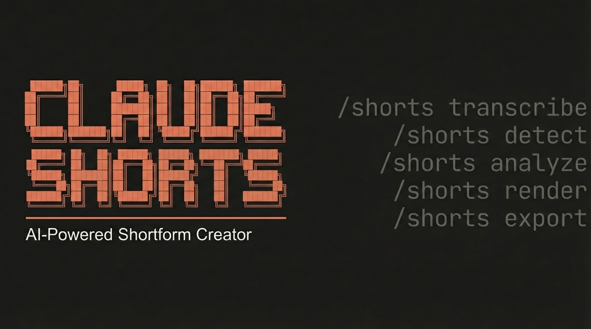

# claude-shorts



Interactive longform-to-shortform video creator powered by [Claude Code](https://docs.anthropic.com/en/docs/claude-code). Extracts viral-ready vertical clips from long videos using Claude as the intelligent orchestrator with Remotion-rendered premium animated captions.

## How It Works

Claude Code guides you through a 10-step interactive pipeline:

1. **Preflight** - Validates input video, checks disk space, detects GPU
2. **Transcribe** - GPU-accelerated transcription with word-level timestamps (faster-whisper)
3. **Detect Content** - Auto-classifies: talking-head, screen recording, or podcast
4. **Analyze** - Claude reads the full transcript and scores 8-12 candidate segments
5. **Present** - Shows candidates in a formatted table with scores, hooks, and rationale
6. **Approve** - You pick segments, adjust timecodes, choose caption style and platform
7. **Snap Boundaries** - Aligns cut points to word boundaries, sentence endings, and audio silences
8. **Prepare** - Extracts clips (FFmpeg stream copy) and computes reframe coordinates
9. **Render** - Remotion renders 1080x1920 vertical video with animated captions
10. **Export** - Platform-optimized encoding (YouTube Shorts, TikTok, Instagram Reels)

## Demo

> Demo video/GIF coming soon — showing the full pipeline from input to rendered short with Hormozi-style captions.

## Features

- **Claude-powered segment scoring** - 5-dimension rubric (hook strength, coherence, emotion, value density, payoff) with weighted scoring. No heuristic keyword matching - Claude understands narrative arcs.
- **3 caption styles** - Hormozi (bold ALL CAPS, yellow highlights), MrBeast (bouncy spring, rotating colors), Clean (minimal fade-in)
- **Cursor tracking** - For screen recordings, detects mouse cursor via frame differencing and smoothly pans the crop to follow it
- **Audio-aware boundary snapping** - Never cuts mid-word or mid-sentence. Extends to natural sentence endings and silence points.
- **Remotion rendering** - React-based single-pass rendering with spring animations, word-level karaoke highlighting, hook text overlays, and progress bars
- **GPU acceleration** - CUDA for transcription, NVENC for export encoding (falls back to CPU gracefully)

## Prerequisites

- **FFmpeg** (system package)
- **Python 3.10+**
- **Node.js 18+**
- **Claude Code** (CLI)
- **NVIDIA GPU** recommended (for CUDA transcription + NVENC encoding)

## Installation

```bash
# Clone the repository
git clone https://github.com/AgriciDaniel/claude-shorts.git
cd claude-shorts

# Install Python + Node.js dependencies
bash setup.sh

# Install as a Claude Code skill
bash install.sh
```

### Windows

claude-shorts requires Unix tools (FFmpeg, bash). On Windows, use [WSL 2](https://learn.microsoft.com/en-us/windows/wsl/install):

```bash
# Inside WSL
git clone https://github.com/AgriciDaniel/claude-shorts.git
cd claude-shorts
bash setup.sh
bash install.sh
```

### What `setup.sh` does

- Creates a Python virtual environment at `~/.shorts-skill/` (or reuses `~/.video-skill/` if it exists)
- Installs `faster-whisper`, `mediapipe`, `numpy`, `opencv-python`, and PyTorch (CUDA or CPU variant)
- Runs `npm install` in the `remotion/` directory
- Checks for system dependencies (FFmpeg, jq)

## Usage

In Claude Code, invoke the skill:

```
/shorts
```

Then provide your video file when prompted. Claude will:

1. Transcribe the video
2. Present scored segment candidates
3. Ask which segments to render, caption style, and target platform
4. Render and export the final shorts

### Example Interaction

```
You: /shorts ~/Videos/my-talk.mp4
Claude: [Transcribes, detects content type, scores segments]

| # | Time          | Dur  | Score | Hook                           |
|---|---------------|------|-------|--------------------------------|
| 1 | 04:22 - 05:01 | 39s  | 87    | "Nobody talks about this..."  |
| 2 | 12:45 - 13:28 | 43s  | 82    | "Here's the exact framework." |
| 3 | 08:11 - 08:52 | 41s  | 79    | "I tested this for 6 months." |

Claude: Which segments? Caption style? Platform?
You: 1 and 3, mrbeast style, youtube

Claude: [Snaps boundaries, extracts clips, renders, exports]
Output: shorts/short_01_yt.mp4, shorts/short_03_yt.mp4
```

## Project Structure

```
claude-shorts/
├── SKILL.md                           # 10-step interactive pipeline (Claude Code skill)
├── CLAUDE.md                          # Project-level instructions
├── install.sh                         # Install to ~/.claude/skills/
├── setup.sh                           # Python + Node dependency installer
│
├── scripts/
│   ├── transcribe.py                  # faster-whisper GPU transcription
│   ├── detect_content.py              # MediaPipe content type classifier
│   ├── compute_reframe.py             # Face tracking + cursor tracking + crop
│   ├── snap_boundaries.py             # Audio-aware boundary snapping
│   ├── preflight.sh                   # Input validation + disk space check
│   ├── detect_gpu.sh                  # NVIDIA NVENC detection
│   └── export.sh                      # Platform-specific FFmpeg encoding
│
├── remotion/
│   ├── package.json                   # Remotion v4 + React 19 + Zod
│   ├── render.mjs                     # Bundle-once-render-many orchestrator
│   ├── remotion.config.ts
│   └── src/
│       ├── Root.tsx                   # Composition registry
│       ├── ShortVideo.tsx             # Main composition
│       ├── types.ts                   # Zod schemas for props
│       ├── components/
│       │   ├── VideoFrame.tsx         # Reframed video with animated crop pan
│       │   ├── Captions.tsx           # Style dispatcher
│       │   ├── HormoziCaptions.tsx    # Bold ALL CAPS, pop-in spring
│       │   ├── MrBeastCaptions.tsx    # Bouncy scale, bright colors
│       │   ├── CleanCaptions.tsx      # Minimal fade-in
│       │   ├── HookOverlay.tsx        # First 3.5s hook text
│       │   └── ProgressBar.tsx        # Bottom progress indicator
│       ├── hooks/
│       │   └── useCaptionPages.ts     # @remotion/captions TikTok-style pages
│       └── styles/
│           ├── fonts.ts               # @font-face declarations
│           └── theme.ts               # Color palettes per style
│
└── references/
    ├── scoring-rubric.md              # 5-dimension scoring criteria
    ├── caption-styles.md              # Visual specs + spring configs
    ├── platform-specs.md              # YouTube/TikTok/Instagram encoding
    └── remotion-patterns.md           # Remotion best practices
```

## Caption Styles

| Style | Font | Animation | Best For |
|-------|------|-----------|----------|
| **Hormozi** | Montserrat Bold | Pop-in spring, yellow active word | Business, education |
| **MrBeast** | Bangers | Bouncy scale 70-120-100%, rotating colors | Entertainment, energy |
| **Clean** | Inter Bold | Fade-in opacity, white + shadow | Professional, interviews |

## Platform Export Specs

| Platform | Codec | Bitrate | Audio |
|----------|-------|---------|-------|
| **YouTube Shorts** | H.264 High 4.2 | 12 Mbps | AAC 192k |
| **TikTok** | H.264 | CRF 18, -preset slow | AAC 128k |
| **Instagram Reels** | H.264 High 4.2 | 4.5 Mbps (max 5000k) | AAC 128k |

## Content Type Strategies

| Content Type | Reframe Strategy | Zoom |
|--------------|-----------------|------|
| **Talking-head** | Face-tracked center crop (MediaPipe) | 9:16 exact |
| **Screen recording** | Cursor-tracked pan with moderate zoom | 55% of source width |
| **Podcast** | Dominant speaker tracking | 9:16 exact |

## Dependencies

### Python (installed via `setup.sh`)
- [faster-whisper](https://github.com/SYSTRAN/faster-whisper) - GPU-accelerated Whisper
- [mediapipe](https://mediapipe.dev/) - Face detection for content classification + reframing
- [numpy](https://numpy.org/) - Array operations for cursor tracking smoothing
- [opencv-python](https://opencv.org/) - Frame differencing for cursor detection

### Node.js (installed via `setup.sh`)
- [Remotion v4](https://remotion.dev/) - React-based video rendering
- [@remotion/captions](https://remotion.dev/docs/captions) - TikTok-style word-level captions
- [React 19](https://react.dev/) - Component framework
- [Zod](https://zod.dev/) - Runtime type validation for props

### Fonts

Caption fonts are bundled from Google Fonts under the [SIL Open Font License](remotion/public/fonts/OFL.txt):
- Montserrat Bold (Hormozi style)
- Bangers Regular (MrBeast style)
- Inter Bold (Clean style)

### System
- [FFmpeg](https://ffmpeg.org/) - Audio extraction, segment cutting, export encoding
- [jq](https://jqlang.github.io/jq/) - JSON processing in shell scripts

## How Segment Scoring Works

Claude scores each candidate on 5 weighted dimensions:

| Dimension | Weight | What Claude Looks For |
|-----------|--------|----------------------|
| Hook Strength | 0.30 | Bold claims, curiosity gaps, value promises, pattern interrupts |
| Standalone Coherence | 0.25 | Makes complete sense without any context from the rest of the video |
| Emotional Intensity | 0.20 | Strong opinions, surprise reveals, humor, passion |
| Value Density | 0.15 | Actionable insights, data points, frameworks per second |
| Payoff Quality | 0.10 | Satisfying conclusion - punchline, reveal, call-to-action |

Final score = weighted sum, scale 0-100. Minimum threshold: 60.

## Support

- **Issues**: [GitHub Issues](https://github.com/AgriciDaniel/claude-shorts/issues)
- **Discussions**: [GitHub Discussions](https://github.com/AgriciDaniel/claude-shorts/discussions)

## License

[MIT](LICENSE)
